## Given an array of integers nums and an integer target, return indices of the two numbers such that they add up to target.
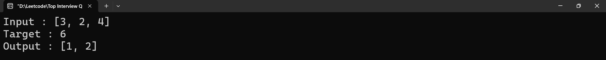

## You are given two non-empty linked lists representing two non-negative integers. The digits are stored in reverse order, and each of their nodes contains a single digit. Add the two numbers and return the sum as a linked list.
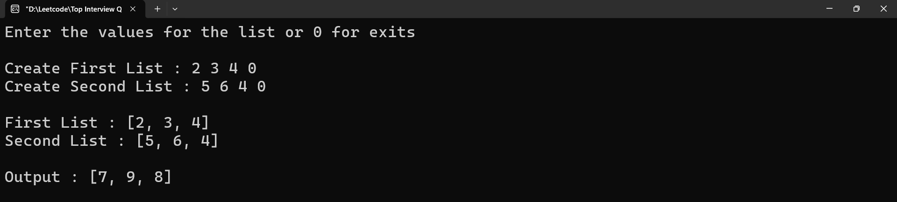

## Given an array of distinct integers candidates and a target integer target, return a list of all unique combinations of candidates where the chosen numbers sum to target. You may return the combinations in any order.
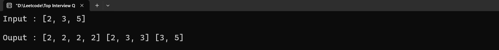

## Given two sorted arrays nums1 and nums2 of size m and n respectively, return the median of the two sorted arrays.
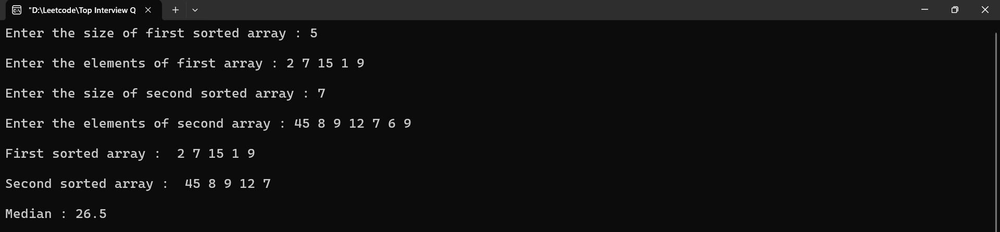

## Given a string s, find the length of the longest substring without repeating characters.
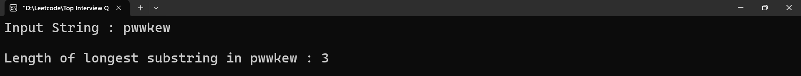

## Given a string s, return the longest palindromic substring in s.
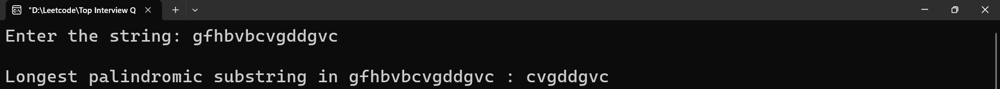

## You are given an integer array height of length n. There are n vertical lines drawn such that the two endpoints of the ith line are (i, 0) and (i, height[i]). Find two lines that together with the x-axis form a container, such that the container contains the most water. Return the maximum amount of water a container can store.
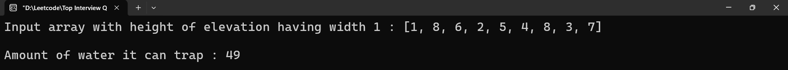

## Given a roman numeral, convert it to an integer.
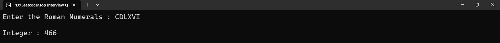

## Write a function to find the longest common prefix string amongst an array of strings. If there is no common prefix, return an empty string "".
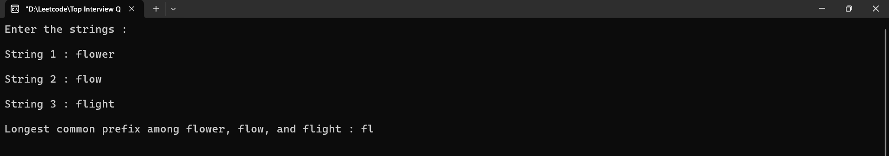

## Given an integer array nums, return all the triplets [nums[i], nums[j], nums[k]] such that i != j, i != k, and j != k, and nums[i] + nums[j] + nums[k] == 0. Notice that the solution set must not contain duplicate triplets.
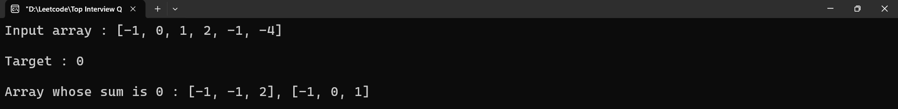

## A mapping of digits to letters (just like on the telephone buttons) is given below. Note that 1 does not map to any letters.
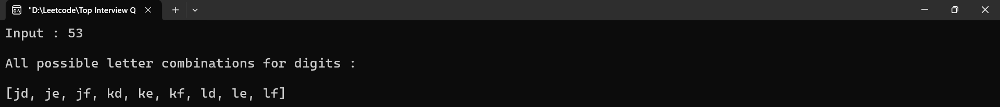

## Given the head of a linked list, remove the nth node from the end of the list and return its head.
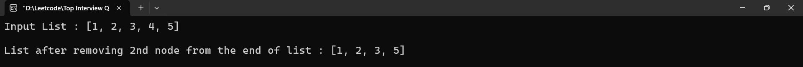

## Given a string s containing just the characters '(', ')', '{', '}', '[' and ']', determine if the input string is valid. An input string is valid if:
### 1. Open brackets must be closed by the same type of brackets.
### 2. Open brackets must be closed in the correct order.
### 3. Every close bracket has a corresponding open bracket of the same type.
 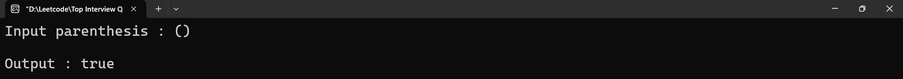
